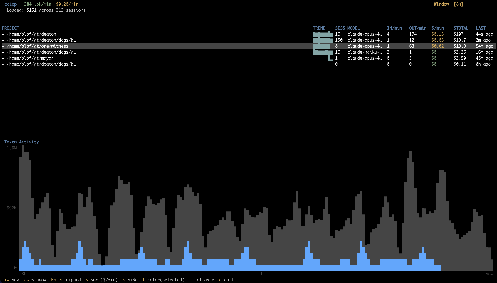

# cctop

Live terminal monitor for Claude Code token usage.


cctop watches Claude Code's session JSONL files in real-time and displays
per-project token rates, costs, and activity trends in an interactive TUI --
think top(1) for your Claude Code spend.

```
 cctop ─ Claude Code Token Monitor                   Window: [5m]
  Rate: 45.2K tok/min   $2.31/min
  Loaded: $87.42 across 12 sessions
────────────────────────────────────────────────────────────────────
 PROJECT              TREND    SESS MODEL       IN/min OUT/min $/min
 ▸/home/user/myproj   ▁▃▅▇█▆▃▁   2 opus-4.6    38.2K   14.1K $1.23
 ▸/home/user/other    ▁▁▁▂▃▅▇█   1 sonnet-4.6   8.4K    3.7K $0.34
────────────────────────────────────────────────────────────────────
 ■in ■out ■cache                              -5m            now
 ▁▁▂▃▃▅▅▆▇▇█▇▆▅▃▂▁▁▁▁▂▃▄▅▆▇█▇▇▆▅▄▃▂▁▁▁▁▁▁▁▂▃▄▅▅▆▇▇█▇▆▅▄▃▂▁
────────────────────────────────────────────────────────────────────
 ↑↓ navigate  ←→ window  Enter expand  s sort  c collapse  q quit
```



## Features

- **Live monitoring** via inotify filesystem notifications -- no polling
- **Hierarchical tree view**: projects > sessions > subagents, expandable with Enter
- **Per-row sparkline** showing each project's activity trend over the window
- **Stacked bar histogram** on the lower half with color-coded token types
  (green = input, blue = output, magenta = cache)
- **Configurable sliding window**: 1m, 5m, 15m, 30m, 1h, 2h, 4h, 8h, 24h
- **Wall-clock-quantized bucketing** so the chart slides smoothly instead of jittering
- **Fast startup**: tail-reads the last 512KB of each JSONL file, even for
  sessions with hundreds of megabytes of history
- **Full pricing table**: 70+ Claude model variants with tiered pricing and
  fast-mode multipliers
- **Keyboard-driven**: vim-style navigation (hjkl), sort cycling, collapse all

## Prerequisites

- **Rust toolchain** (1.85+ for edition 2024) -- install via [rustup](https://rustup.rs/)
- **Claude Code** installed and used at least once (cctop reads its session
  files from `~/.claude/projects/`)
- **Linux** (uses inotify for file watching; macOS support via kqueue is
  untested but may work through the `notify` crate)

## Installation

### From source (recommended)

```sh
git clone https://github.com/olofj/cctop
cd cctop
cargo install --path .
```

This installs the `cctop` binary to `~/.cargo/bin/`, which should be in your
`PATH` if you installed Rust via rustup.

### Build without installing

```sh
git clone https://github.com/olofj/cctop
cd cctop
cargo build --release
# Binary at ./target/release/cctop
```

You can copy or symlink the binary wherever you like:

```sh
cp target/release/cctop ~/.local/bin/
```

## Usage

Just run `cctop` while Claude Code is active in another terminal:

```sh
cctop
```

It will immediately show all projects with token activity from the last 24
hours, and update live as new API responses come in.

### Command-line options

```
cctop [OPTIONS]

Options:
  -w, --window <WINDOW>    Initial time window [default: 5m]
                           Values: 1m, 5m, 15m, 30m, 1h, 2h, 4h, 8h, 24h
  -p, --project <PROJECT>  Filter to projects matching this substring
      --list-projects      List all discovered projects and exit
      --tick-rate <MS>     UI refresh interval in milliseconds [default: 250]
  -h, --help               Print help
  -V, --version            Print version
```

### Examples

```sh
# Monitor with a 1-hour window
cctop -w 1h

# Only show projects with "myapp" in the path
cctop -p myapp

# See what projects Claude Code knows about
cctop --list-projects

# Full day view
cctop -w 24h
```

### Reading the display

The top half shows a **table** with one row per project:

- **PROJECT** -- decoded filesystem path of the project
- **TREND** -- sparkline of token activity over the window (oldest left, newest right)
- **SESS** -- number of active sessions in the window
- **MODEL** -- the model consuming the most cost in the window
- **IN/min** -- input tokens per minute (prompt tokens sent to the API)
- **OUT/min** -- output tokens per minute (response tokens from the API)
- **$/min** -- estimated cost per minute based on the model pricing table
- **$TOTAL** -- total cost for this project across all loaded data
- **LAST** -- time since the last API response

The bottom half shows a **histogram** of total token activity over the window,
color-coded by token type (green = input, blue = output, magenta = cache).

Projects can be **expanded** with Enter to show individual sessions, and
sessions can be expanded further to show subagent activity.

### Keyboard shortcuts

| Key | Action |
|-----|--------|
| `q` / `Esc` | Quit |
| `↑` `↓` / `j` `k` | Navigate rows |
| `Enter` / `Space` | Expand/collapse project or session |
| `←` `→` / `h` `l` | Shrink/grow time window |
| `s` | Cycle sort column ($/min, IN/min, OUT/min, Last, Project) |
| `S` | Reverse sort direction |
| `d` | Hide selected project from the table |
| `u` | Unhide all hidden projects |
| `c` | Collapse all expanded rows |
| `g` / `G` | Jump to top/bottom |
| `PgUp` / `PgDn` | Scroll by page |
| `Ctrl-C` | Quit |

## How it works

Claude Code stores per-session token usage in JSONL files under
`~/.claude/projects/`. cctop discovers these files, tail-reads recent entries
on startup, then uses inotify to watch for new data in real-time. Each JSONL
line containing `input_tokens` is parsed, costed against the pricing table,
and fed into a time-windowed in-memory store. The TUI renders at 4 Hz,
recomputing rates and histograms from the windowed data.

## Acknowledgments

This project would not exist without
[ccusage](https://github.com/ryoppippi/ccusage) by
[@ryoppippi](https://github.com/ryoppippi) -- the original Node.js CLI tool
for analyzing Claude Code token usage. cctop's data format understanding,
pricing table, file discovery logic, and cost calculation are all derived from
a Rust port of ccusage. Thank you for building the tool that made this possible.

## License

[MIT](LICENSE)
